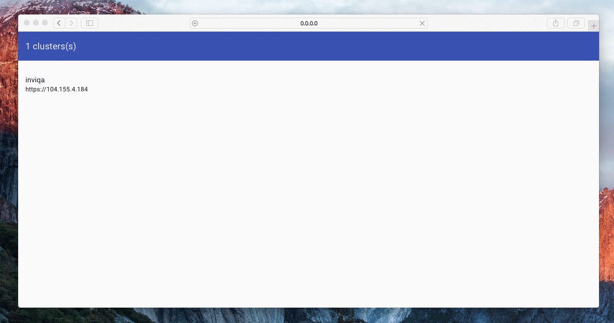

# Kubernetes Status

This application allows to get the status of a Kubernetes cluster through a simple API endpoint, and brings a user interface with it.
It will gives you both a real-time and an historical view of the status of your cluster.

## User interface



## Usage

```
kubectl -f extras/kube/deployment.yml
kubectl -f extras/kube/service.yml
```

### Cluster providers

The cluster provider is responsible of providing the list and credentials of the clusters to the other parts of the system. Right now
the following implementations exists:

- `in-memory`. Will provide the cluster list from an environment variable.
- `within-k8s`. Will provide the Kubernetes cluster in which kube-status is running.
- `continuous-pipe`. Will provide the Kubernetes clusters from all the clusters of all the teams you have access from [ContinuousPipe](https://continuouspipe.io).

```
-cluster-provider=[provider]
```

#### In memory cluster provider

In order to use this provider, you will need these environment variables:

Name | Required | Description | Example
--- | --- | --- | ----
`CLUSTER_LIST` | Yes | An inline JSON description of your clusters | `[{"identifier":"my-cluster","address":"https://1.2.3.4","username":"-","password":"-"}]` |

#### ContinuousPipe cluster provider

In order to use this provider, you will need these environment variables:

Name | Required | Description | Example
--- | --- | --- | ----
`CONTINUOUS_PIPE_API_KEY` | Yes | The API key to use to call the API | ø |


### History storage backend

The storage backends will be responsible of storing the fetched statuses. The following implementations exists:

- `in-memory`. The status history is stored in the memory of kube-status
- `google-cloud-datastore`. Google Cloud Datastore is used as a backend.

By default the `in-memory` implementation is used but you can select the backend you want to use with the following flag:
```
-history-storage-backend=[backend]
```

#### In-memory backend

**Warning**: If your kube-status process restarts, the history is erased.

It will store at maximum 720 statuses in memory.

#### Google Cloud Datastore

In order to use the Google Cloud Datastore backend, you need to configure the following environment variables:

Name | Required | Description | Example
--- | --- | --- | ----
`GOOGLE_CLOUD_PROJECT_ID` | Yes | Identifier of your Google Cloud project | ø |
`GOOGLE_CLOUD_SERVICE_ACCOUNT` | Yes | Base64-encoded service account JSON file | ø |

**Note:** you'll have to have your DataStore indexes matching the ones in `extras/google-cloud-datastore/indexes.yaml`. Uses the `gcloud preview datastore create-indexes [file-path]` command to create these indexes.


#### Garbage collection

If you want not to keep the entries for a long time, you can enable the garbage collection of history. Use the following environment variable
to configure it:

Name | Required | Description | Example
--- | --- | --- | ----
`ONLY_KEEP_HOURS_OF_HISTORY` | No | The number of hours you want to keep the data for each cluster | `24` for... a day ;-) |

**Note:** this is right now only supported by the Google Cloud Datastore storage, as the memory one as a fixed buffer size anyway.


### Environment variables

Name | Required | Description | Example | Default
--- | --- | --- | --- | ---
`KUBE_STATUS_LISTEN_ADDRESS` | Yes | The to expose the API to | `http://127.0.0.1:8080` | ø
`SNAPSHOT_INTERVAL` | No | The internal, in minutes, to do the snapshots | `http://127.0.0.1:8080` | 5

## API

In addition to the user interface, kube-status exposes an API that you can directly communicates with.

### `GET /clusters`

List the clusters in your backend.

### `GET /clusters/{identifier}/status`

Return the live status of a cluster.

### `GET /clusters/{identifier}/history`

*Query parameters*
- `from`: beginning of the history (RFC3339 date)
- `to`: end of the history (RFC3339 date)

Return the list of the history entries available for this cluster.

### `GET /clusters/{identifier}/history/{entry-uuid}`

Return the snapshotted status of the given cluster for this history entry.

## Development

1. Install the dependencies
  ```
  make install-dep
  ```

2. Run the API
  ```
  CLUSTER_LIST='[{"identifier":"my-cluster","address":"https://1.2.3.4","username":"-","password":"-"}]' \
      KUBE_STATUS_LISTEN_ADDRESS=http://0.0.0.0:80
      go run main.go
  ```
